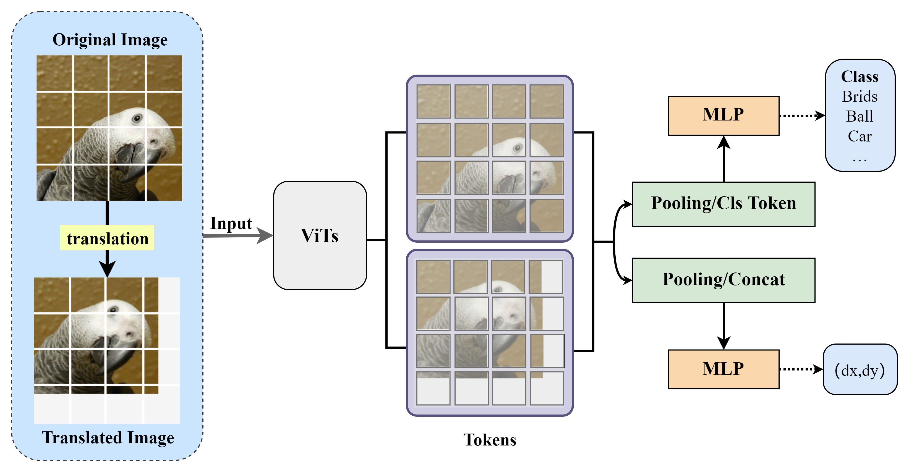
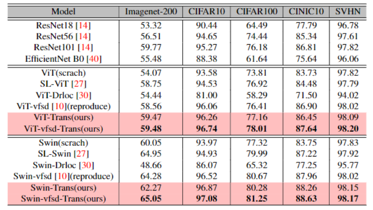
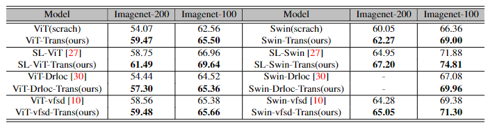

# Train_ViT_Translation_Perceptibility

## Contents

1. [Abstract](#Abstract)
2. [Motivation](#Motivation)
3. [Contritution](#Contritution)
4. [Train with translation perceptibility](#Train-with-translation-perceptibility)
7. [Main Exam](#Main-Exam)
10. [References](#References)



## Abstract

> **Abstract:** The Vision Transformer (ViT) has become a popular vision model in recent years, replacing traditional Convolutional Neural Network (CNN) models. However, ViTs tend to require a larger amount of data due to the lack of some properties inherent in the CNN architecture. To address this problem, researchers have proposed various methods to optimize ViTs' performance on small datasets. In this paper, we propose a self-supervised auxiliary task to guide ViTs in learning translation perceptibility, which enables the models to acquire inductive bias more efficiently from small datasets, without the need for pre-training on large datasets or modifications to the network architecture. The effectiveness of the approach has been demonstrated on multiple small datasets, as well as its scale perceptibility, and its application in conjunction with current state-of-the-art methods has further improved performance. Our codes are available at: https://github.com/cmcamdy/Train_ViT_Translation_Perceptibility.


## Motivation
> - We observed that both convolutional layers and fully connected layers utilize matrix operations at the underlying level to perform computations in neural networks. The difference lies in the special parameter distribution present in convolutional layers, which provides them with a unique advantage in handling translation equivariance. Based on this observation, we speculate that to some extent, fully connected layers can partially replace certain characteristics of convolutional layers, such as translation equivariance, while preserving the intrinsic features.

## Contritution
> - We propose a simple self-supervised auxiliary task to guide ViTs in learning translation perceptibility without changing the model structure, which helps the model learn inductive bias more efficiently from small datasets, aiding ViTs in achieving better performance.
> - We demonstrate the effectiveness of our approach on multiple small datasets, and further show that our approach is scalable and can be used in conjunction with the current state-of-the-art methods to further improve performance.
> - By extending the proposed auxiliary task to guide ViTs in learning scale sensitivity, we present empirical evidence that this method enhances ViTs' perception of hierarchical characteristics.

## Train with translation perceptibility
```
cd vits-for-small-scale-datasets
root_path=/YOUR/PROJECT/ROOT/PATH
datapath=${root_path}/datasets/tiny-imagenet-200
output_dir=${root_path}/outputs/ssloff/vit_base_imagenet-200
python finetune_affine.py --arch vit  \
        --dataset Tiny-Imagenet \
        --datapath ${datapath} \
        --batch_size 128 \
        --epochs 300 \
        --output_dir ${output_dir} \
        --tag vfsd_with_trans \
        --ls --lr 0.001 \
        --alpha_trans 0.4 \
        --init_weight 1.2 \
        --with_trans
```

## Integration with other approaches

### SPT_LSA_ViT(SL-ViT)
- script path: Train_ViT_Translation_Perceptibility/SPT_LSA_ViT/script/
```shell
root_path=/YOUR/PROJECT/ROOT/PATH
data_path=${root_path}/datasets/tiny-imagenet-200
dataset=T-IMNET
batch_size=128
save_path=${root_path}/outputs/spt_lsa
tag=vit-spt-lsa-open-img100-affine_trans-vit
python main_affine.py --with_trans --model vit --data_path ${data_path} --dataset ${dataset} --batch_size ${batch_size} --save_path ${save_path} --tag ${tag} --is_LSA --is_SPT
```
### vits-for-small-scale-datasets(vfsd)
- script path: Train_ViT_Translation_Perceptibility/vits-for-small-scale-datasets/script/train_ssl_imagenet-200_vit_vfsd.sh
```
root_path=/YOUR/PROJECT/ROOT/PATH
datapath=${root_path}/datasets/tiny-imagenet-200
pretrained_weights=${root_path}/outputs/ssloff/vit_base_imagenet-200/checkpoint.pth
output_dir=${root_path}/outputs/ssloff/vit_base_imagenet-200
python finetune_affine.py --arch vit  \
        --dataset Tiny-Imagenet \
        --datapath ${datapath} \
        --batch_size 128 \
        --epochs 300 \
        --output_dir ${output_dir} \
        --pretrained_weights ${pretrained_weights} \
        --tag vfsd_with_trans \
        --ls --lr 0.001 \
        --alpha_trans 0.4 \
        --init_weight 1.2 \
        --with_trans
```

### VTs-Drloc(Drloc)
- script path: Train_ViT_Translation_Perceptibility/VTs-Drloc/main_affine.sh
```
DATA_DIR=/YOUR/DATA/DIR
IMG_SIZE=32 # 224, 384
MODE=vitcs # swintiny, cvt13, t2t, resnet50, vit
CONFIG=vitcs_base_16 # swin_tiny_patch4_window7, cvt_13, t2tvit_14, resnet_50, vit_base_16
LAMBDA_DRLOC=0.5 # swin: 0.5, t2t: 0.1, cvt: 0.1
DRLOC_MODE=l1 # l1, ce, cbr
BATCH_SIZE=128
# DATASET=imagenet-100 # imagenet-100, imagenet, cifar-10, cifar-100, svhn, places365, flowers102, clipart, infograph, painting, quickdraw, real, sketch
DATASET=cifar-100
NUM_CLASSES=100

DISK_DATA=${DATA_DIR}/datasets/${DATASET}
TARGET_FOLDER=${DATASET}-${MODE}-sz${IMG_SIZE}-drloc${LAMBDA_DRLOC}-bs${BATCH_SIZE}-choose_trans
SAVE_DIR=${DATA_DIR}/outputs/SPTv3/visiontransformer-expr/${TARGET_FOLDER}

python3 -m torch.distributed.launch  --master_port 65001 \
    main_affine.py \
    --cfg ./configs/${CONFIG}_${IMG_SIZE}.yaml \
    --dataset ${DATASET} \
    --num_classes ${NUM_CLASSES} \
    --data-path ${DISK_DATA} \
    --batch-size ${BATCH_SIZE} \
    --output ${SAVE_DIR} \
    --lambda_drloc ${LAMBDA_DRLOC} --drloc_mode ${DRLOC_MODE} --use_drloc  --use_abs --with_trans
```

## Main Exam
- We test our approach on 5 small low resolution datasets: Tiny-Imagenet, CIFAR10, CIFAR100, CINIC10 and SVHN. We compare the results of our approach with 5 baselines: ConvNets, Scratch ViT training, [Efficient Training of Visual Transformers with Small Datasets (NIPS'21)](https://openreview.net/forum?id=SCN8UaetXx), [Vision Transformer for Small-Size Datasets (arXiv'21)](https://arxiv.org/abs/2112.13492), [How to Train Vision Transformer on Small-scale Datasets?(BMVC'22)](https://arxiv.org/abs/2210.07240)
    - 
- To assess the scalability of our approach, we integrated our proposed self-supervised task(trans) into various existing methods while maintaining consistent settings. The obtained results revealed that our method effectively enhances the previous state-of-the-art (SOTA) approaches, thereby demonstrating its broad scalability.
    - 
## References
- Our code is build on the repositories of 
    - [How to Train Vision Transformer on Small-scale Datasets? (BMVC'22)](https://github.com/hananshafi/vits-for-small-scale-datasets)
    - [Efficient Training of Visual Transformers with Small Datasets(NerIPS'21)](https://github.com/yhlleo/VTs-Drloc) 
    - [Vision Transformer for Small-Size Datasets](https://github.com/aanna0701/SPT_LSA_ViT). 
- We thank them for releasing their code.

